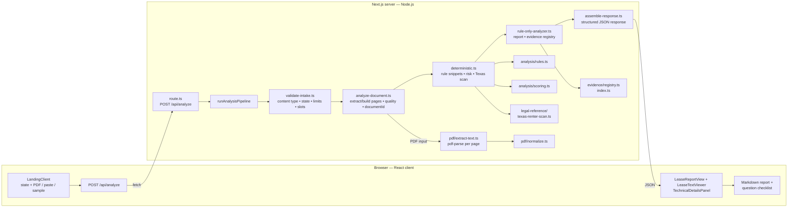

# BeforeYouSign

## What this is

**BeforeYouSign** is a Next.js web app that helps renters review **residential lease** documents before signing. Users upload a PDF lease, paste plain text, or load sample lease fixtures. The server validates the request, extracts and normalizes lease text, runs **rule-based clause detection** and **deterministic review-priority scoring**, then builds a **structured report** with grounded evidence. Results stay in the browser for the current review and can be exported as Markdown.

## Problem it solves

Lease agreements are long and written in dense legal language. Renters often struggle to quickly spot **costs, notice and renewal rules, maintenance or utility responsibilities, and clauses worth questioning**. This project reduces that friction by highlighting likely pressure points and summarizing them in plain language, while staying **informational** (not legal advice).

## Features

- **PDF lease upload** with server-side text extraction (`pdf-parse`), plus **paste text** and **built-in sample leases** from `public/sample-leases/`.
- **Structured report UI**: named report sections for summary, terms to review, money and fees, deadlines, responsibilities, questions, state checks, next steps, and “not clearly stated” items when applicable.
- **Evidence linking**: grounded findings show the exact quote, page, and source span; an explicit action opens and highlights that span in the **extracted text** viewer.
- **Rule-based snippet extraction** (rent, deposit, fees, notice, renewal, maintenance, utilities, and vague phrases) plus a **deterministic review-priority band** with reasons.
- **Rule-only analysis**: the current product path has no model call; the report is assembled from lease pattern matches, extracted text, and curated state-reference metadata.
- **State-aware scope**: all 50 states can be selected; Texas has curated statewide renter references, while other states receive general lease review only.
- **Analysis transparency** so users can see extraction quality, matched clauses, evidence coverage, and risk signals.
- **Full report Markdown export** (client-side download) plus existing question checklist export.

See the [historical pattern-extraction audit](docs/POLICYINSIGHT_EXTRACTION_AUDIT.md) for decisions and deferred scope. The supported current workflow is deterministic and synchronous.

## Tech stack

**Frontend:** Next.js App Router, React, TypeScript, Tailwind CSS v4, Lucide icons, and shadcn-style UI primitives (`src/components/ui/`). The supported product theme is light-only. `pdf-lib` is used for client-side PDF preview metadata.

**Backend:** Node.js Next.js Route Handler — `POST /api/analyze` (`src/app/api/analyze/`) with request validation, upload limits, in-process concurrency guards, and structured error responses.

**Analysis:** Synchronous, rule-only lease pattern matching, risk scoring, Texas topic scanning, evidence registration, and structured report assembly.

**Supporting code:** `pdf-parse` for server-side PDF text extraction, `pdf-lib` for browser preview, curated Texas reference metadata, Vitest, and Playwright QA scripts.

There is no database, account system, background job, or runtime call to an external analysis service.

## Setup

### 1. Clone the repo

```bash
git clone https://github.com/ChimdumebiNebolisa/BeforeYouSign.git
cd BeforeYouSign
```

### 2. Install dependencies

```bash
npm ci
```

Use Node.js 24. Local development, CI, and Vercel use the version declared in `.nvmrc`.

### 3. Configure the environment

Create a `.env.local` file in the root (you can start from `.env.local.example`):

**Windows (cmd):** `copy .env.local.example .env.local`
**macOS / Linux:** `cp .env.local.example .env.local`

No API key is required for local development. The supported environment variables are:

```text
BYS_TRUST_PROXY_HEADERS=0  # Set to 1 only when the deployment proxy overwrites client IP headers.
BYS_ANALYSIS_EVENTS=1      # Set to 0 to disable metadata-only analysis event logs.
```

When proxy headers are not explicitly trusted, the app uses the global in-process concurrency cap. When they are trusted, it also applies a per-client cap. Analysis event logs contain metadata only; lease text is not logged.

### 4. Run the app locally

```bash
npm run dev
```

Open the local URL shown in the terminal (typically [http://localhost:3000](http://localhost:3000)).

---

## How it works

For this project:

1. **Choose intake:** Select the rental-property state, then upload a PDF, paste lease text, or load a sample lease from the UI (`src/components/beforeyousign/`).
2. **Submit analysis:** After the lease confirmation, the client sends **`POST /api/analyze`** — **multipart/form-data** (`file`, `stateCode`) for PDFs or **JSON** (`leaseText`, `fileName`, `stateCode`) for pasted/sample text.
3. **Validate and admit:** `runAnalysisPipeline` checks the content type, state, request size, PDF signature, page/character limits, and in-flight analysis caps before processing.
4. **Prepare the document:** PDFs are extracted per page through **`extractPdfTextPages`** and normalized; pasted/sample text is normalized and represented as one synthetic page. Extraction quality and a content-derived `documentId` are recorded.
5. **Run deterministic analysis:** `runDeterministicAnalysis` calls the rule finders, computes the risk band and reasons, flags unclear phrases, and runs the Texas renter scan only when Texas is selected.
6. **Assemble grounded results:** `createRuleOnlyAnalyzer` builds the fallback report, registers evidence spans, and returns an evidence index. `assembleSuccessResponse` packages the report, pages, snippets, risk fields, state guidance, and extraction metadata.
7. **Render and export:** The client keeps the response in memory and renders **`LeaseReportView`**, **`LeaseTextViewer`**, and **`TechnicalDetailsPanel`**. Findings can link back to source text, and the report/checklist can be downloaded as Markdown.

## Architecture

The main boundaries are:

```txt
src/app/: App Router entry points, layout, assets, and POST /api/analyze.
src/components/beforeyousign/: Intake, loading, report, source-text viewer, details, and export UI.
src/components/ui/: Shared UI (e.g. Button).
src/lib/analysis/pipeline/: Request validation, document preparation, deterministic orchestration, and response assembly.
src/lib/analysis/: Rule finders, scoring, report schema/normalization, fallback report, and exports.
src/lib/evidence/: Page segmentation, evidence registry, response index, and source highlighting data.
src/lib/pdf/: PDF extraction (`pdf-parse`), text normalization, and extraction-quality checks.
src/lib/jurisdiction/: Supported states and state-guidance status.
src/lib/legal-reference/: Curated Texas renter references and lease-topic scanner.
public/sample-leases/: Text fixtures used by the sample-lease flow.
tests/: Unit, integration, end-to-end, and lease/report fixtures.
scripts/: Production-server smoke and browser-QA runners.
```

The request is synchronous. There is **no database or queue**; the report and extracted text live in client state after the response. Texas references are curated static metadata and are not scraped at runtime.

### End-to-end flow



**Flow notes:** pasted/sample text is normalized during intake and skips PDF extraction. `pdf-lib` only supports browser-side preview metadata. The current `AnalysisMode` is `rules_only`; there is no AI/model branch in the supported request path.

---

## Verification

Pull requests and pushes to `main` run the required [`ci` workflow](.github/workflows/ci.yml): clean install, lint, typecheck, unit tests, coverage, deterministic evaluation, legal-reference metadata checks, a production build, Playwright browser tests, browser-QA scripts, an API smoke test, support-script syntax checks, and a production dependency audit.

Run the same static and analysis checks locally:

```bash
npm run lint
npm run typecheck
npm test
npm run test:coverage
npm run evaluate
npm run verify:legal-metadata
npm run build
```

The CI workflow also verifies that committed support scripts parse successfully:

```bash
node --check scripts/phase2-scan-smoke.mjs
node --check scripts/smoke-test.mjs
node --check scripts/phase1-browser-qa.mjs
node --check scripts/phase2-browser-qa.mjs
node --check scripts/run-scan-smoke.mjs
node --check scripts/evaluate.mjs
node --check scripts/run-browser-qa.mjs
node --check scripts/verify-legal-metadata.mjs
```

Run production-build browser tests after `npm run build`:

```bash
npm run test:e2e
```

`verify:legal-metadata` checks reference IDs, review dates, URL syntax, and disclaimer metadata; it does not validate legal meaning. Complete the quarterly source review in [LEGAL_SOURCE_REVIEW.md](LEGAL_SOURCE_REVIEW.md) separately.

The smoke and browser-QA runners start and stop their own production server. Build first, then run:

```bash
npm run smoke:scan
npm run qa:smoke
npm run qa:phase1
npm run qa:phase2
```

Install Playwright browser binaries first if you have not run browser QA on this machine:

```bash
npx playwright install chromium firefox webkit
```

The browser QA scripts use Playwright and write ignored screenshots under `test-results/browser-qa/`. CI uploads failed browser artifacts for seven days.

---

## Known limitations

- **No user accounts or persisted reports** — results live in browser memory and are lost when the page is closed or a new review is started.
- **Rule-only analysis** — regex and heuristic matching can miss clauses, produce false positives, or lack the context a lawyer would apply.
- **Single synchronous HTTP request** — the route allows up to 60 seconds and the browser waits up to 55 seconds; very large or slow inputs may time out.
- **PDF text extraction is not OCR** — scanned image-only PDFs may yield little or no extractable text.
- **Input limits apply** — PDF files are capped at 4 MiB and 100 pages; extracted or pasted text is capped at 120,000 characters. JSON request bodies are capped at 512 KiB.
- **State scope is limited** — Texas has curated statewide renter references; other states receive general lease review, and city rules are not checked.
- **Evidence highlighting** uses extracted-text offsets and quote matching; minor mismatches between source text and normalized quotes can prevent a highlight.
- **Concurrency protection is in-process** — the global and optional per-client caps reset with the server instance and are not a substitute for edge/platform rate limiting in a multi-instance deployment.
