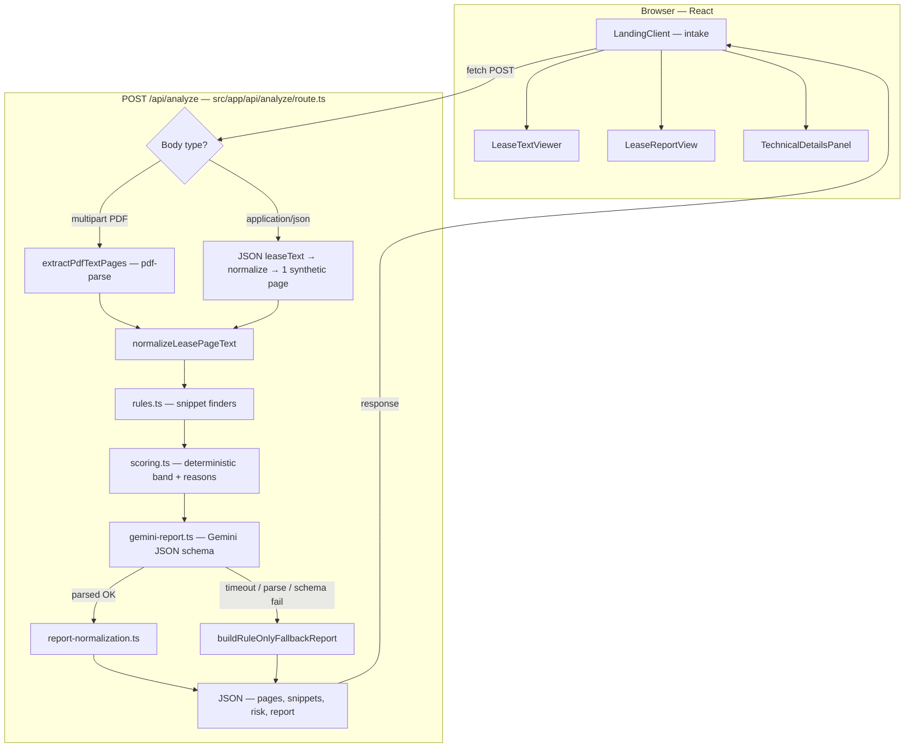
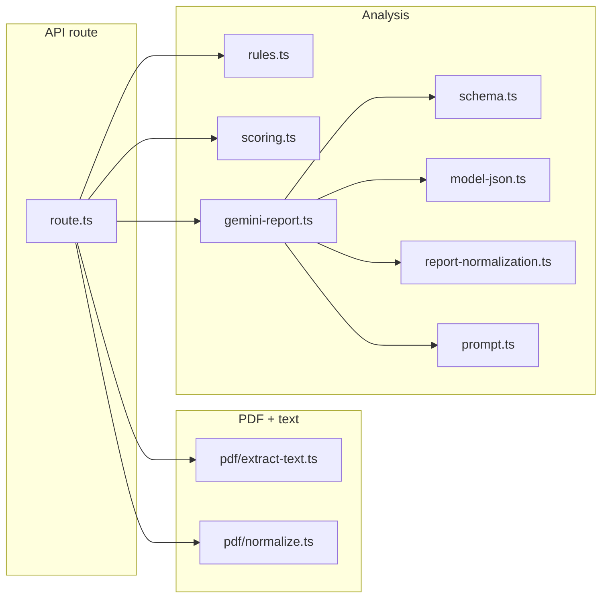

# BeforeYouSign

**BeforeYouSign** is a Next.js app for reviewing residential leases. You can upload a PDF, paste lease text, or use built-in samples. Analysis runs on the server with **Google Gemini** and returns structured findings (fees, notices, risk signals, and more).

---

## What you need

- **Node.js** (current LTS is a good choice)
- **npm**

---

## Where things live

The Next.js app is at the **repository root** (`BeforeYouSign/`). Run every `npm` command from this folder—there is no nested app directory.

---

## Run it locally

### 1. Install dependencies

```bash
npm install
```

### 2. Configure environment

Create `.env.local` from the example file:

- **Windows (cmd):** `copy .env.local.example .env.local`
- **macOS / Linux:** `cp .env.local.example .env.local`

Then set your variables (see [Environment variables](#environment-variables) below).

### 3. Start the dev server

```bash
npm run dev
```

Open [http://localhost:3000](http://localhost:3000).

---

## Environment variables

Set these in **`.env.local`** (server-side only).

| Variable           | Required | Notes |
|--------------------|----------|--------|
| `BYS_AI_KEY`       | Yes      | Google AI API key. |
| `BYS_GEMINI_MODEL` | No       | Defaults to `gemini-2.5-flash` if omitted. |

Do **not** use the `NEXT_PUBLIC_` prefix for these values—they must never be bundled for the browser.

---

## Sample leases (no PDF required)

In the UI, use **Try Sample Lease** to load plain-text fixtures from `public/sample-leases/`:

| File             | What it exercises |
|------------------|-------------------|
| `standard.txt`   | Balanced rent, deposit, renewal, and notice language. |
| `fee-heavy.txt`  | Multiple fees and late/NSF-style charges. |
| `notice-heavy.txt` | Renewal and notice-period–heavy language. |

Useful for quick end-to-end checks without uploading a file.

---

## Optional: PDF extraction debug logs

Enables extra server-side logging while extracting text from PDFs.

**Windows (cmd)—set for the session, then start the app:**

```bat
set BEFOREYOUSIGN_PDF_DEBUG=1
npm run dev
```

**macOS / Linux:**

```bash
export BEFOREYOUSIGN_PDF_DEBUG=1
npm run dev
```

---

## npm scripts

| Command           | Purpose |
|-------------------|---------|
| `npm run dev`     | Development server with hot reload. |
| `npm run build`   | Production build. |
| `npm run start`   | Run the production server (after `build`). |
| `npm run lint`    | Run ESLint. |

---

## Architecture

High-level request flow from the browser through the single analyze route and back. There is **no database**: results exist only in client state after the response.

### End-to-end flow



### Key modules



**Notes**

- **`BYS_AI_KEY`**: If unset, the route still returns **snippets and deterministic risk**, but **`report` may be null** with a user-facing `reportError` string instead of a Gemini-produced report.
- **Paste/sample text** skips PDF extraction and is analyzed as a single virtual page.

---

## Stack (short)

Next.js (App Router), React, TypeScript, Tailwind CSS, Gemini (`@google/generative-ai`), PDF tooling (`pdf-parse`, `pdf-lib`).

For general Next.js topics (routing, deployment, etc.), see the [Next.js documentation](https://nextjs.org/docs).
