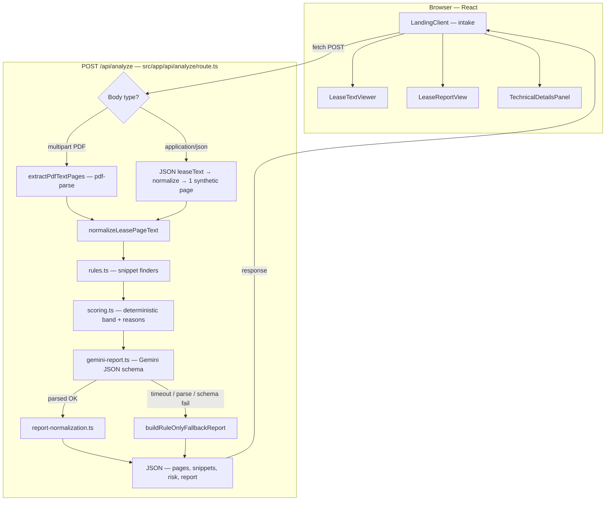
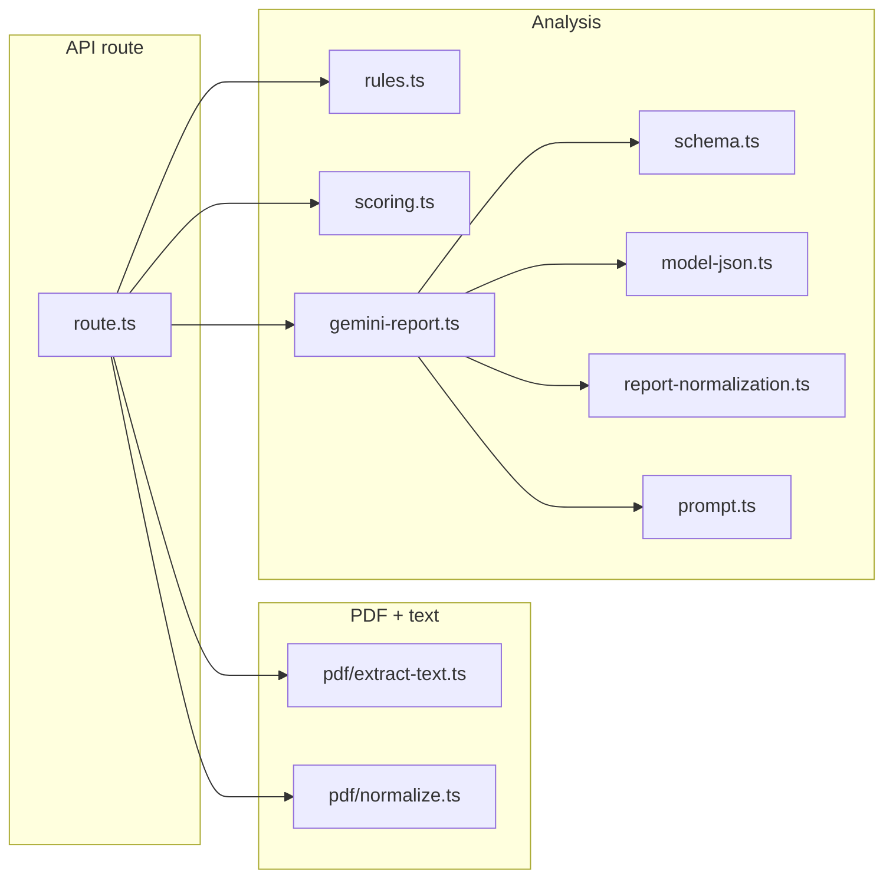

# BeforeYouSign

## What this is

**BeforeYouSign** is a Next.js web app that helps renters review **residential lease** documents before signing. Users upload a PDF lease, paste plain text, or load sample lease fixtures. The server extracts text (when needed), runs **regex-based clause detection** and **deterministic risk scoring**, and optionally calls **Google Gemini** to produce a **structured JSON report** (summary, fees, deadlines, red flags, suggested questions). Results display in the browser with evidence quotes tied to page-level extracted text.

## Problem it solves

Lease agreements are long and written in dense legal language. Renters often struggle to quickly spot **costs, notice and renewal rules, maintenance or utility responsibilities, and clauses worth questioning**. This project reduces that friction by highlighting likely pressure points and summarizing them in plain language, while staying **informational** (not legal advice).

## Features

- **PDF lease upload** with server-side text extraction (`pdf-parse`), plus **paste text** and **built-in sample leases** from `public/sample-leases/`.
- **Structured report UI**: carousel sections for summary, red flags, money and fees, deadlines, responsibilities, questions, next steps, and “not clearly stated” when applicable.
- **Evidence linking**: clicking report rows can scroll the **extracted text** viewer and highlight matching quotes by page.
- **Rule-based snippet extraction** (rent, deposit, fees, notice, renewal, maintenance, utilities, vague phrases) and **deterministic risk band** with reasons.
- **Gemini-powered narrative report** with JSON schema validation; **fallback report** built from rules when the model fails or returns invalid JSON.
- **Transparency panel** (“How this was analyzed”) showing extraction counts, snippet hits, and heuristic risk signals.

## Tech stack

**Frontend:** Next.js (App Router), React, TypeScript, Tailwind CSS v4, Embla Carousel, Lucide icons, shadcn-style UI primitives (`src/components/ui/`).

**Backend:** Next.js Route Handler — single endpoint `POST /api/analyze` (`src/app/api/analyze/route.ts`), Node runtime.

**AI/API:** Google Gemini via `@google/generative-ai` (`src/lib/analysis/gemini-report.ts`), structured output aligned with `src/lib/analysis/schema.ts`.

**Other tools:** `pdf-parse` + `pdf-lib` (`src/lib/pdf/`), ESLint (`npm run lint`), Playwright QA smoke scripts.

## Setup

### 1. Clone the repo

```bash
git clone https://github.com/ChimdumebiNebolisa/BeforeYouSign.git
cd BeforeYouSign
```

### 2. Install dependencies

```bash
npm install
```

### 3. Add environment variables

Create a `.env.local` file in the root (you can start from `.env.local.example`):

**Windows (cmd):** `copy .env.local.example .env.local`
**macOS / Linux:** `cp .env.local.example .env.local`

```env
BYS_AI_KEY=
BYS_GEMINI_MODEL=gemini-2.5-flash
```

Environment variables used:

```md
BYS_AI_KEY: Google AI API key for Gemini (server-side only; never use NEXT_PUBLIC_).
BYS_GEMINI_MODEL: Optional model id; defaults to gemini-2.5-flash if unset.
```

Optional for development:

```bat
set BEFOREYOUSIGN_PDF_DEBUG=1
```

(Unix: `export BEFOREYOUSIGN_PDF_DEBUG=1`) — enables extra PDF extraction logging on the server.

### 4. Run the app locally

```bash
npm run dev
```

Open the local URL shown in the terminal (typically [http://localhost:3000](http://localhost:3000)).

---

## How it works

For this project:

1. **Choose intake:** Upload a PDF, paste lease text, or load a sample file from the UI (`src/components/beforeyousign/`).
2. **Submit analysis:** The client sends **`POST /api/analyze`** — **multipart** (`file`) for PDFs or **JSON** (`leaseText`, optional `fileName`) for pasted/sample text (`landing-client.tsx`, `route.ts`).
3. **Prepare text:** PDFs are read per page via **`extractPdfTextPages`**; pasted text becomes a single synthetic page. All text passes **`normalizeLeasePageText`** (`src/lib/pdf/`).
4. **Deterministic pass:** **`rules.ts`** extracts snippet matches; **`scoring.ts`** computes a risk band and reasons; ambiguous phrases are flagged (`findUnclearLeasePhrases`).
5. **AI report (when configured):** **`runStructuredLeaseAnalysis`** calls Gemini with **`buildLeaseAnalysisUserPrompt`**; responses are parsed (**`model-json.ts`**), validated (**`parseBeforeYouSignReportJson`**), and normalized (**`report-normalization.ts`**). On failure, **`buildRuleOnlyFallbackReport`** supplies a report-shaped fallback (`route.ts`).
6. **Render results:** JSON returns **`extractedPages`**, snippet arrays, deterministic risk fields, and **`report`**. The client shows **`LeaseTextViewer`**, **`LeaseReportView`**, and **`TechnicalDetailsPanel`** (`landing-client.tsx`).

## Architecture

Brief folder layout:

```txt
src/app/: App Router — layout, page, favicon/app icons, POST /api/analyze route.
src/components/beforeyousign/: Intake, report carousel, text viewer, loading shell.
src/components/ui/: Shared UI (e.g. Button).
src/lib/analysis/: Regex rules, Gemini, schema, scoring, prompts, normalization.
src/lib/pdf/: PDF extraction (pdf-parse) and text normalization.
public/: Static assets — sample leases, images.
```

System overview:

```txt
Frontend: React client components; single-page lease intake and results.
Backend: Next.js Route Handler (Node) — one analyze endpoint; no separate API server.
External services: Google Gemini API (when BYS_AI_KEY is set).
Deployment: Standard Next.js production build (npm run build && npm run start); host per your platform (e.g. Vercel-compatible).
```

High-level request flow — there is **no database**; results live in client state after the response.

### End-to-end flow



### Key modules



**Notes**

- **`BYS_AI_KEY`**: If unset, the route still returns **snippets and deterministic risk**, but **`report` may be null** with a user-facing `reportError` string instead of a Gemini-produced report.
- **Paste/sample text** skips PDF extraction and is analyzed as a single virtual page.

---

## Verification

Pull requests run the **QA script syntax** GitHub Actions workflow, which installs dependencies and verifies the committed QA scripts parse successfully:

```bash
node --check scripts/phase2-scan-smoke.mjs
node --check scripts/smoke-test.mjs
node --check scripts/phase1-browser-qa.mjs
node --check scripts/phase2-browser-qa.mjs
```

Run static linting:

```bash
npm run lint
```

Run the API scan smoke test against a running local server:

```bash
npm run dev
npm run smoke:scan
```

Run browser QA smoke checks against a running local server:

```bash
npm run qa:smoke
npm run qa:phase1
npm run qa:phase2
```

The browser QA scripts use Playwright and write screenshots under `qa-screenshots/` for visual review.

---

## Known limitations

- **No user accounts or persisted reports** — refreshing loses in-session results unless the user runs analysis again.
- **Single synchronous HTTP request** — very large PDFs or slow model responses may hit hosting timeouts (`maxDuration` on the route is capped for serverless-style deployments).
- **PDF text extraction is not OCR** — scanned image-only PDFs may yield little or no extractable text.
- **Evidence highlighting** uses substring matching (`indexOf` on the quote); minor mismatches between model quotes and extracted text can prevent a highlight.
- **Automated `npm test` suite** is not present in this repo; use the **QA script syntax** workflow, **`npm run lint`**, **`npm run smoke:scan`**, and the Playwright QA scripts for repeatable checks.
